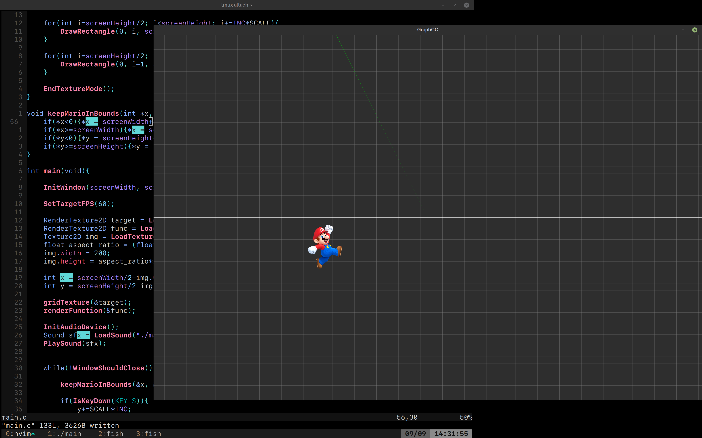

# GraphCC
- goofy desmos with mario cameo, in C

## TODO:
- [x] show axes
- [x] show grid
- [x] scale grid with user input
- [x] align grid to axes
- [ ] draw functions
- [x] add mario
- [x] make mario move
- [x] "it's a me, mario"
